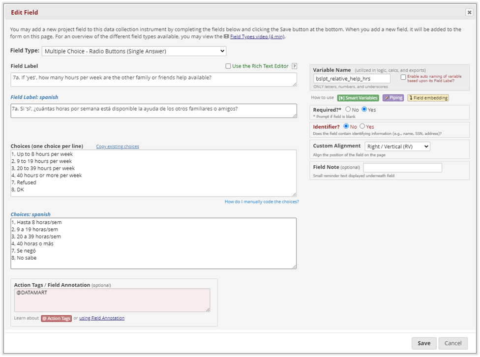
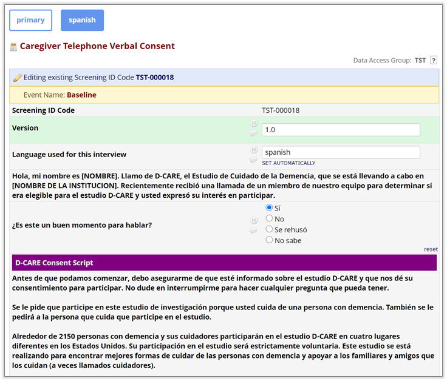
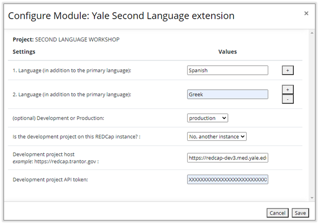

# Second Language External Module
Version 1.0.0   
October 2020  
Pete Charpentier and the REDCap@Yale team  
https://portal.redcap.yale.edu  

> Tested on:
> - REDCap versions 9.1.23, 10.2.3
> - MariaDb 10.0.28, 10.1.44
> - MySQL 5.1.73
> - PHP 5.6.37, 7.0.33, 7.1.20, 7.2.32

### What does it do?
The Second Language EM supports multiple languages for REDCap forms.
It is similar to Multilingual, but more basic and designer-friendly.

### Features
- Any number of languages can be supported.
- On-the-fly language switch, with the option to save the language used to a REDCap form field.
- Does not modify REDCap metadata: translations are stored in an auxiliary table.
- Optimized for easier form design:
  - The REDCap editor is used as-is for the primary language.
  - UI elements for translations (field labels, choice sets, matrix items) 
  are inserted in-line, and are clones of their primary language counterparts.
  - Full-size, resizable textarea controls are provided for all translations.
  
### REDCap Field Editor UI Enhancements

- Based on suggestions and testing from our form designers.
- The Primary Language is managed by the REDCap Field Editor exactly as without the EM.
- The input controls for translated labels and choice sets are cloned from the REDCap Field Editor controls, and so have identical dimensions, styles and other properties.<sup>1</sup>
- Labels and choice sets for translations are initialized from the primary language.
- REDCap metadata are not altered in any way: translations are stored in an auxiliary table.

> #### NOTE  
> The Second Language design editor extensions for a new field will not be displayed until after you have first saved it. 
We typically design each form in English and then after a period of field testing and refinement add the translations later, 
so that for us this behavior is not an impediment. 
Later versions of Second Language will have a more sophisticated approach to loading the field editor extensions. 



<sub><sup>1</sup>You cannot use the Rich Text Editor for translations. If you require HTML in your translations and want to use
the Rich Text Editor, we suggest that you: 
(1) use the Rich Text Editor to generate the HTML for the Primary Language;
(2) if necessary copy and paste the HTML into the translation (generally it will autopopulate); and
(3) edit the translation as necessary.</sub>

### REDCap Form UI Enhancements
- Buttons are provided for each supported language (primary and additional)
- Support is provided for each form to have a “language” field that will store the language under which the form was administered (i.e., any field having the ```@LANGUAGE``` Action Tag will be auto populated with the language).
- The new(ish) floating matrix header is supported.  



### Utilities
Second Language provides two utilities that are accessible to project administrators:
1. Copy from Dev: this utility will transfer translations from the development project (if it is defined in the Project Configuarion) into the current project.
2. Print create-table SQL: this utility will print an SQL script that may be used to create the required auxiliary table.


The ```Copy from Dev``` utility will open a panel summarizing the copy, with a button to execute the copy.
A number of checks are run to anticipate and forestall any catastrophes caused by an incorrect project configuration.  

For example, the metadata for the development and production projects are matched and the count of common fields for which there are translations is displayed in the panel.
If this count is very low, it's a good bet that the wrong development project has been specified.
  


Note: Translations in the production project are not deleted; rather they are marked as archived with a unique backup id.
It would be possible for a DBA to roll back any transfer.  


### Project Configuration
A sample Second Language configuration is shown below.
The settings fall into two groups:

- Languages - enter as many languages as you need to support.
- Settings for a production project for which there is a development project. 
The development project may reside on the same REDCap instance (host) or on a separate instance.
    - If the development project is on the same REDCap instance, you will be required to select the project from a dropdown.
    - If the development project is on another REDcap instance, you will
    be required to provide the host URL and an API token for the project.
    The API token should be associated with a user or service account having API export
    privileges but no data access privileges.



#### Storing the language in a form field
An additional configuration is support for any form field to be auto-populated by the Second Language EM,
via the ```@LANGUAGE``` Action Tag. 
A form field having the ```@LANGUAGE``` Action Tag will be initialized to the language under which the form was administered.  

Once the form is marked as 'complete', the value of this field will not be changed.
This allows the form to be viewed in any language while preserving the language
used for the interview.  

This field will also control the default language under which the form is subsequently opened.
  


### System Configuration
The Second Language EM uses an auxiliary table to store translations.
This table must be created by a database administrator before Second Language can be used.  
The SQL script is shown below, but it may also be printed using a project-level link that is provided to super users by the EM.  

The advantage to printing out the script after installing the EM is that the
collation in the script will match that for the REDCap tables (or more specifically, the ```redcap_metadata``` table).  

```
CREATE TABLE IF NOT EXISTS ydcclib_translations
(
    xlat_id          INT AUTO_INCREMENT PRIMARY KEY,
    project_id       INT                NOT NULL,
    xlat_language    VARCHAR(64)        NULL,
    xlat_parent      VARCHAR(64)        NULL,
    xlat_entity_type CHAR(10)           NULL,
    xlat_entity_name VARCHAR(100)       NULL,
    xlat_label       MEDIUMTEXT         NULL,
    xlat_choices     MEDIUMTEXT         NULL,
    xlat_created_by  VARCHAR(64)        NULL,
    xlat_created_on  DATETIME           NULL,
    xlat_modified_by VARCHAR(64)        NULL,
    xlat_modified_on DATETIME           NULL,
    deleted          SMALLINT DEFAULT 0 NULL,
    xlat_backup_id   CHAR(16)           NULL
)
    COLLATE = utf8mb4_unicode_ci;

CREATE INDEX project_id
    ON ydcclib_translations (project_id);

CREATE INDEX project_id__entity_type__parent
    ON ydcclib_translations (project_id, xlat_entity_type, xlat_parent);

CREATE INDEX project_id__language
    ON ydcclib_translations (project_id, xlat_language);

CREATE INDEX project_id__language__entity_type
    ON ydcclib_translations (project_id, xlat_language, xlat_entity_type);

CREATE INDEX project_id__language__entity_type__entity_name
    ON ydcclib_translations (project_id, xlat_language, xlat_entity_type, xlat_entity_name);

CREATE INDEX xlat_entity_name
    ON ydcclib_translations (xlat_entity_name);

CREATE INDEX xlat_entity_type
    ON ydcclib_translations (xlat_entity_type);

CREATE INDEX xlat_language
    ON ydcclib_translations (xlat_language);

CREATE INDEX xlat_parent
    ON ydcclib_translations (xlat_parent);
```


